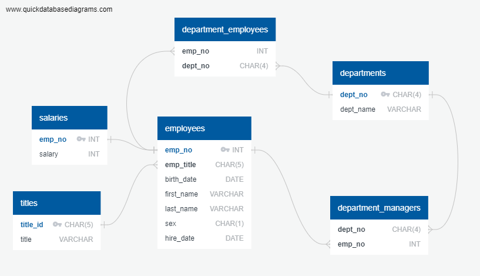

# sql-challenge
A research project about company employees during the 1980s and 1990s. The employee database from that period is imported to a SQL database, which is then used to answer questions about the data. This project involves data modeling, data engineering, and data analysis.

##Technologies
PostgreSQL

##Data Source
"Data found in EmployeeSQL/Data".

